# Practice 1.1 - Installing and configuring Web Development Tools

### 2DAW - DWEC Bilingual. 

> **Student Name**:  José Montoro Rojas

#### Files included in this repository:

Ennumerate and explain each one of the files included in this repo.

- File 1
- File 2
- Etc...

#### Instructions: 

- Fill your name and lastname and answer the questions in the current `README.md` file. You have to submit the activity as a GitHub repo link that has to include the 

- You can add images to this tocument with the syntax:

    ```md
    
    ```

- Any other question about Markdown language you can find in the [Markdown Cheat Sheet](https://www.markdownguide.org/cheat-sheet/)

### Install and configure VSCode

1. **Install `VSCode` in your computer**.
2. **Create a new folder called `p1.1-frontend-tools`and open it as a workspace in VSCode. Copy the current `README.md` inside it**.
3. **What functionalities do the following VSCode extensions add?**
   - **Bootstrap 5 quick Snippets**
     - It adds shortcuts to create simple components, such as navbars, cards, forms...
   - **Live Server**
     - Allows you to run the file locally on your computer, refreshing it each time you save your file to see the new changes.
   - **Prettier**
     - Formats the code for you if you set it on "Format on save" or with a hotkey.
   - **Markdown All in One**
     - Enhances Markdown files, content tables are made automatically, and adds much more functions

4. **Install the extensions listed in the previous point in VSCode**.
   - I had them already installed :(
5. **What other extensions do you know that you consider interesting for developing in JavaScript**?
6. **Find in VSCode the option in `Settings` to `Format On Save` and activate it. What effect has this option?**
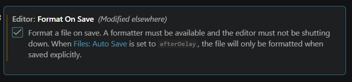
  It uses prettier to format the code once you save the file without you needing to do it manually.

### Create a Hello World in JS

7. **Create an `index.html` file inside your worspace folder.**
8. **Create the basic html structure using the `!` snippet and change the title to 'Hello World'**

    ```html
    <!DOCTYPE html>
    <html lang="en">
    <head>
      <meta charset="UTF-8">
      <meta name="viewport" content="width=device-width, initial-scale=1.0">
      <title>Hello World</title>
    </head>
    <body>
      
    </body>
    </html>
    ```
  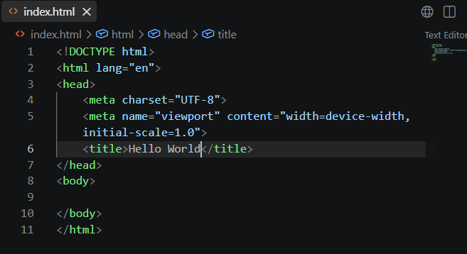

9. **Create a new file called `app.js` and add this two lines**

    ```js
    console.log("Hello Console!")
    document.body.innerHTML = "<h1>Hello document!<h1>"
    ```
  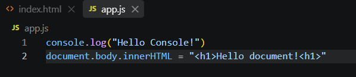
  
10. **Import the script in your html using one of the techniques explained in class. Explain here the technique, show the code and justify why did you choose this technique**.
    I imported the script using ```<script src="app.js" defer></script>``` in the head. I chose this option because defer ensures the JS runs after the HTML is fully loaded.
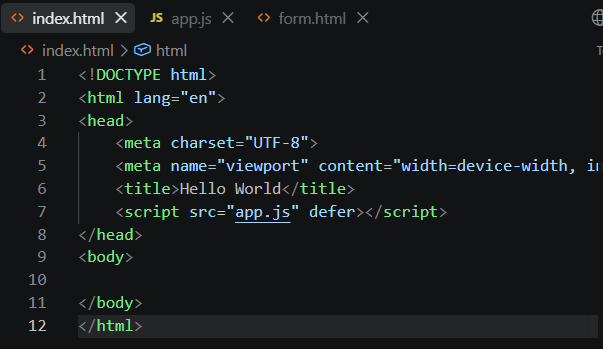

11.  **Launch `index.html` in Live Server and check that the script is running. Click right button and select inspect to show the developer tools and take a look on the console.**
    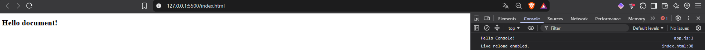
    
12.  **Change some message in the JS code and sava changes. You can check that Live Server refreshes the web page.**
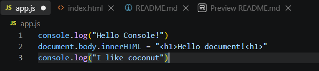
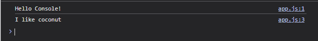

### Create a simple form with Bootstrap 4. 

13. **At this point, we are going to create a page called `form.html` starting from the `Bs5-$` template provided by the Bootstrap extension we added. What files does this template import in the html by default?**
    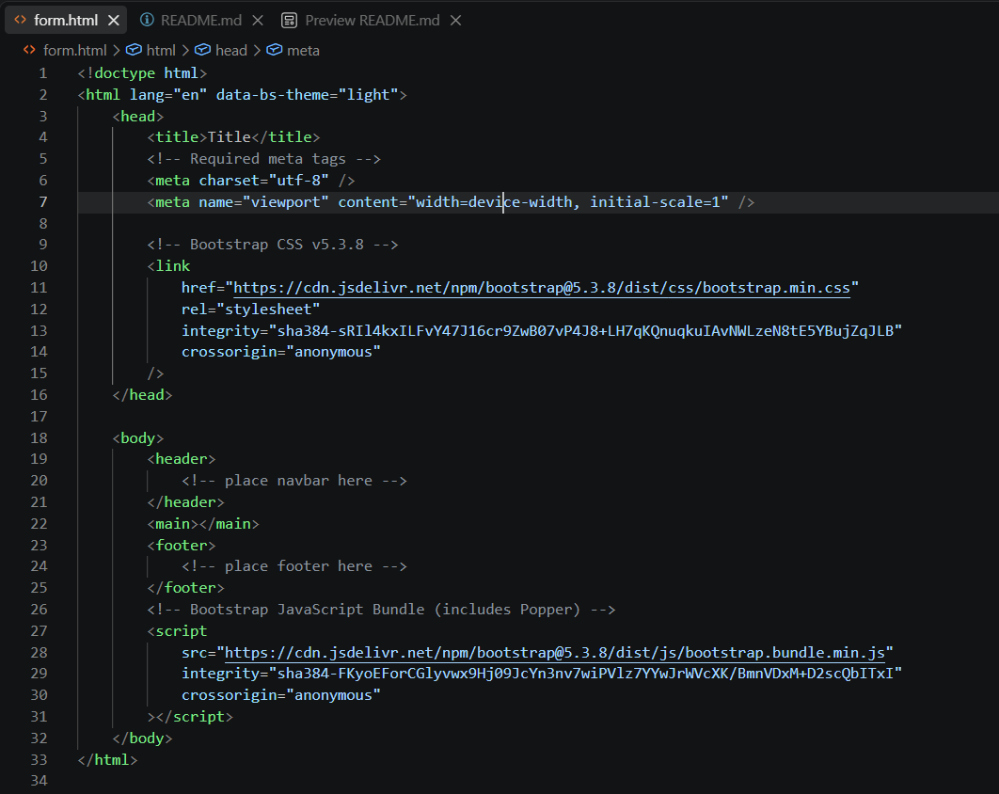
    
14. **Create a `<div>`with the class `.container` to wrap all the sections in the web page**
    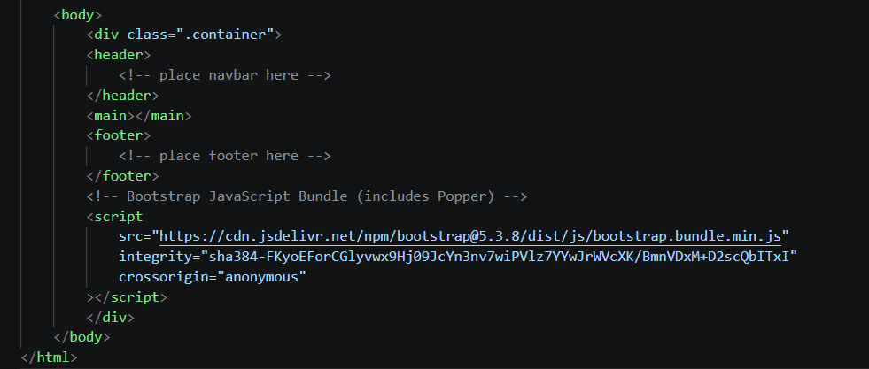
  
15. **Add a standard navigation bar inside the nav area using the `bs5-navbar-standard` snippet inside the container**
    (Its not fittin on a picture, show you what it placed <3)
    ```
      <nav
                class="navbar navbar-expand-sm navbar-light bg-light"
            >
                <div class="container">
                    <a class="navbar-brand" href="#">Navbar</a>
                    <button
                        class="navbar-toggler d-lg-none"
                        type="button"
                        data-bs-toggle="collapse"
                        data-bs-target="#collapsibleNavId"
                        aria-controls="collapsibleNavId"
                        aria-expanded="false"
                        aria-label="Toggle navigation"
                    >
                        <span class="navbar-toggler-icon"></span>
                    </button>
                    <div class="collapse navbar-collapse" id="collapsibleNavId">
                        <ul class="navbar-nav me-auto mt-2 mt-lg-0">
                            <li class="nav-item">
                                <a class="nav-link active" href="#" aria-current="page"
                                    >Home
                                    <span class="visually-hidden">(current)</span></a
                                >
                            </li>
                            <li class="nav-item">
                                <a class="nav-link" href="#">Link</a>
                            </li>
                            <li class="nav-item dropdown">
                                <a
                                    class="nav-link dropdown-toggle"
                                    href="#"
                                    id="dropdownId"
                                    data-bs-toggle="dropdown"
                                    aria-haspopup="true"
                                    aria-expanded="false"
                                    >Dropdown</a
                                >
                                <div
                                    class="dropdown-menu"
                                    aria-labelledby="dropdownId"
                                >
                                    <a class="dropdown-item" href="#"
                                        >Action 1</a
                                    >
                                    <a class="dropdown-item" href="#"
                                        >Action 2</a
                                    >
                                </div>
                            </li>
                        </ul>
                        <form class="d-flex my-2 my-lg-0">
                            <input
                                class="form-control me-sm-2"
                                type="text"
                                placeholder="Search"
                            />
                            <button
                                class="btn btn-outline-success my-2 my-sm-0"
                                type="submit"
                            >
                                Search
                            </button>
                        </form>
                    </div>
                </div>
            </nav>
    ```

16. **Inside the main area create a form using Bootstrap to collect data from a new user who wants to register at an academy that offers courses. We can copy code from [Bootstrap Documentation](https://getbootstrap.com/docs/5.0/forms/overview/)**. 
    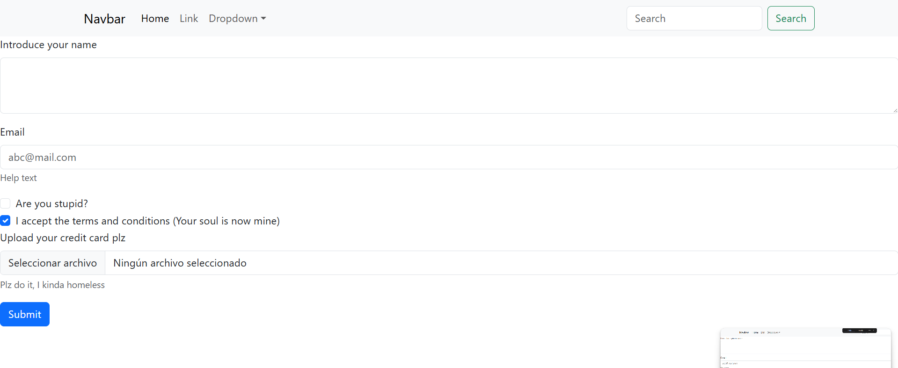

### Install Git, and upload your repository to GitHub

17. **Install [git](https://git-scm.com/) in your computer**.
    (I already had it installed.)
18. **Init the git repository**
    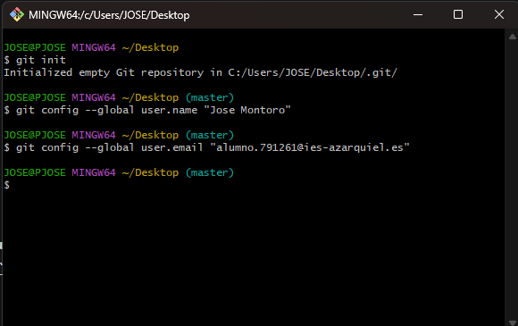
    
19. **Log in to your GitHub account provided by IES Azarquiel**
    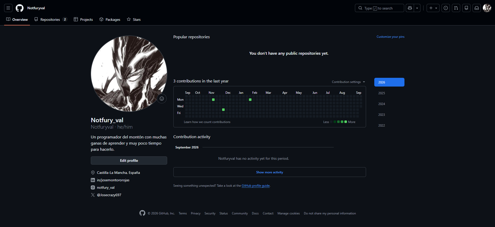
20. **Follow the teacher on GitHub at the following link: [https://github.com/jeatzr/](https://github.com/jeatzr/)**
    
21. **Create a new empty repository on GitHub named `p1.1-frontend-tools`.**
    
22. **Follow the instructions in the command line provided by GitHub to add your files, create the first commit and push it. Notice that in out case we have to add all files to the staged area with `git add .`, not just`git add README.md`** 
    
23. **To finish, submit the link of your GH repo to the task in our Classroom.**